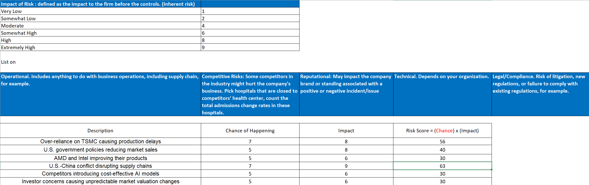
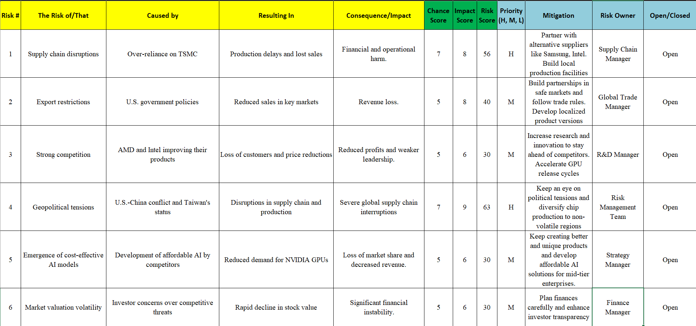
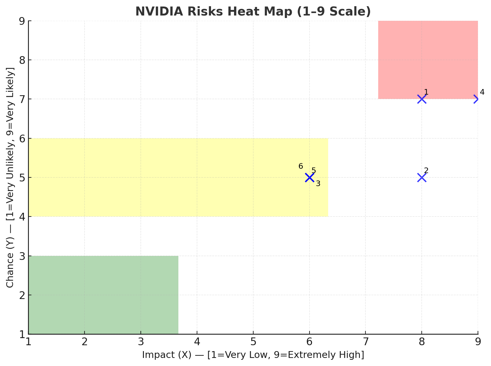
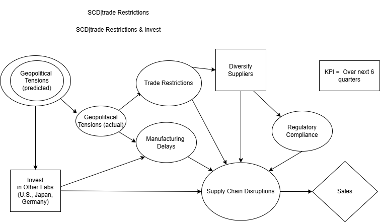
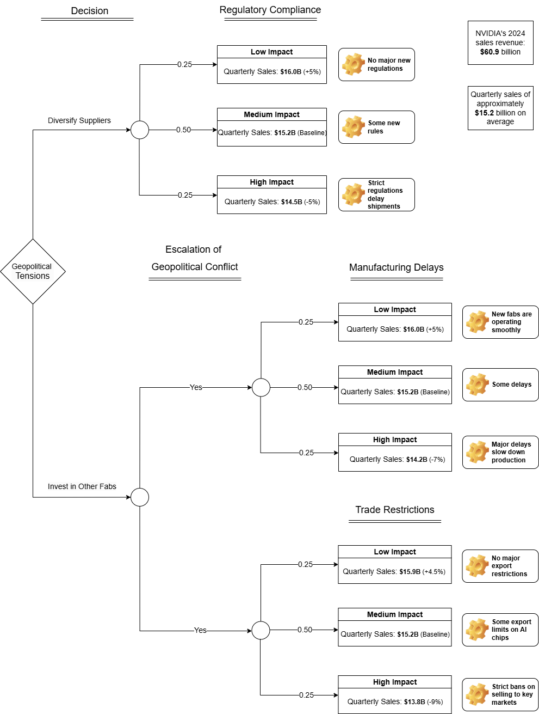
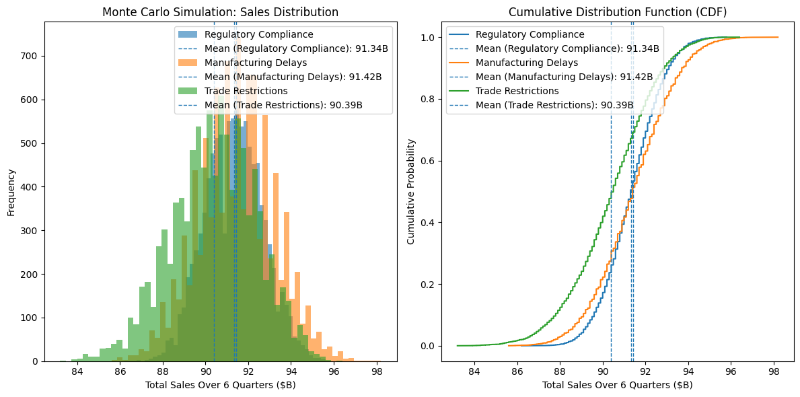

# Project Walkthrough

## 1. Project Overview

This project was my final project for **ALY6130: Risk Management for Analytics**.

I used NVIDIA as the case company and built a structured risk management analysis around one main question:

**How can NVIDIA identify, prioritize, and respond to major business risks in a practical way?**

This GitHub version is my cleaned public version. I kept the final report, the final briefing slides, selected visuals, one notebook, and a small archive of original project files.

Main links:

- [Final report](../reports/aly6130-final-report.pdf)
- [Final briefing slides](../slides/aly6130-module-6-briefing.pdf)
- [Notebook](../scripts/01_nvidia_risk_analysis.ipynb)
- [Data note](../data/README.md)
- [Outputs note](../outputs/README.md)

## 2. Business Problem

NVIDIA has strong growth in GPUs and AI, but it also faces several risks that could hurt operations and revenue.

The biggest concerns in this project were:

- dependence on TSMC
- export restrictions
- competition from AMD and Intel
- geopolitical tensions around U.S.-China relations and Taiwan
- lower-cost AI competition
- market valuation volatility

The final version focused most on two high-priority risks:

- Supply Chain Disruptions
- Geopolitical Tensions

## 3. Original Course Goal

The course project was built step by step across multiple modules.

The final assignment asked for a full risk management project that included:

- risk identification
- qualitative and quantitative assessment
- KRI
- scenario modeling
- treatment and response planning
- communication and continuous monitoring

I kept that overall structure in the final version of this repo.

## 4. Project Inputs and Data Structure

This project is not built around a large downloaded dataset.

The main inputs were:

- public company filings
- public business and news sources
- manually built risk scores
- project working Excel files
- scenario assumptions for six-quarter sales
- simulated revenue outputs

Supporting project working files are kept in:

- [Risk calculation sheet (original)](../archive/nvidia-risk-calculation-sheet-original.xlsx)
- [Risk register (original)](../archive/nvidia-risk-register-original.xlsx)

See the full note here:

- [data/README.md](../data/README.md)

## 5. Workflow

My workflow for this project was:

1. Identify major NVIDIA business risks  
2. Build a six-risk register  
3. Score risks by chance and impact  
4. Use a heat map to narrow the focus  
5. Build an influence diagram and scenario tree  
6. Summarize six-quarter revenue impact with Monte Carlo analysis  
7. Translate the results into mitigation, KRI, and response planning  

## 6. Final Risk Register

The final project used six risks:

1. Supply Chain Disruptions  
2. Export Restrictions  
3. Strong Competition  
4. Geopolitical Tensions  
5. Emergence of Cost-Effective AI Models  
6. Market Valuation Volatility  

The final scoring highlighted two high-priority risks:

- Supply Chain Disruptions
- Geopolitical Tensions

### Supporting visuals

- [Risk calculation sheet](../outputs/figures/nvidia-risk-calculation-sheet.png)
- [Risk register](../outputs/figures/nvidia-risk-register.png)





## 7. Heat Map Logic

After scoring the risks, I used a heat map to show which risks were both high chance and high impact.

That visual helped confirm that the project should focus more on:

- supply chain risk
- geopolitical risk

### Figure



## 8. Influence Diagram and Scenario Tree

In the later project stage, I focused more on **Geopolitical Tensions** as the main modeling case.

The influence diagram connected geopolitical instability to:

- trade restrictions
- manufacturing delays
- supply chain disruptions
- sales impact

The updated scenario tree translated those ideas into three main paths:

- regulatory compliance
- manufacturing delays
- trade restrictions

### Figures

- [Influence diagram](../outputs/figures/latest-influence-diagram.png)
- [Scenario tree](../outputs/figures/updated-scenario-tree.png)





## 9. Notebook Work

The notebook in this repo is:

- [01_nvidia_risk_analysis.ipynb](../scripts/01_nvidia_risk_analysis.ipynb)

The notebook focuses on the main public analysis logic:

- final risk score setup
- 1-9 scale heat map
- updated Monte Carlo simulation
- updated CDF comparison

### Selected code idea

```python
def monte_carlo_simulation(sales_data, simulations=10000, quarters=6):
    results = []
    for _ in range(simulations):
        total_sales = 0
        for _ in range(quarters):
            scenario = np.random.choice(
                ["Calm", "Moderate", "Intense"],
                p=[0.25, 0.50, 0.25]
            )
            sales = np.random.choice(sales_data[scenario])
            total_sales += sales
        results.append(total_sales)
    return results
```

This part mattered because it turned the scenario assumptions into a simple six-quarter revenue impact comparison.

## 10. Monte Carlo and CDF Result

The updated final version compared three paths:

- Regulatory Compliance
- Manufacturing Delays
- Trade Restrictions

My main read from the final comparison was:

- Regulatory Compliance had a narrower and safer range
- Manufacturing Delays showed more uncertainty
- Trade Restrictions showed the biggest downside risk

### Figure



## 11. Final Insight

My main conclusion was that NVIDIA’s biggest risks were not only general business threats.

The more useful point was that:

- the risks could be structured and scored
- the top risks could be translated into scenario logic
- the analysis could support practical action ideas like supplier diversification, fab expansion, KRI thresholds, and faster response planning

So the project became more like business risk decision support, not just a class report.

## 12. What I Would Say in an Interview

A simple way I would explain this project is:

> This was my individual risk management analytics project on NVIDIA.  
> I started with a six-risk register and used scoring plus a heat map to narrow the focus to supply chain and geopolitical risk.  
> Then I used scenario modeling and Monte Carlo analysis to show how those risks could affect revenue over the next six quarters, and I connected the results to mitigation planning and KRI design.

## 13. File Map

### Main public files
- [README](../README.md)
- [Final report](../reports/aly6130-final-report.pdf)
- [Final slides](../slides/aly6130-module-6-briefing.pdf)
- [Notebook](../scripts/01_nvidia_risk_analysis.ipynb)

### Supporting notes
- [Data note](../data/README.md)
- [Scripts note](../scripts/README.md)
- [Outputs note](../outputs/README.md)

### Archive files
- [Original treatment and response plan](../archive/nvidia-risk-treatment-and-response-plan-original.docx)
- [Portfolio PDF v1](../archive/aly6130-nvidia-risk-portfolio-v1.pdf)
- [Risk calculation sheet (original)](../archive/nvidia-risk-calculation-sheet-original.xlsx)
- [Risk register (original)](../archive/nvidia-risk-register-original.xlsx)